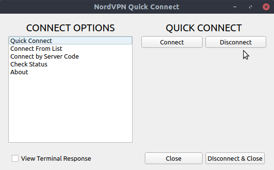
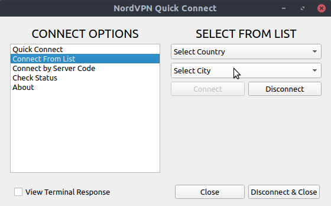
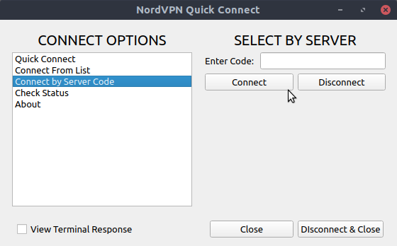
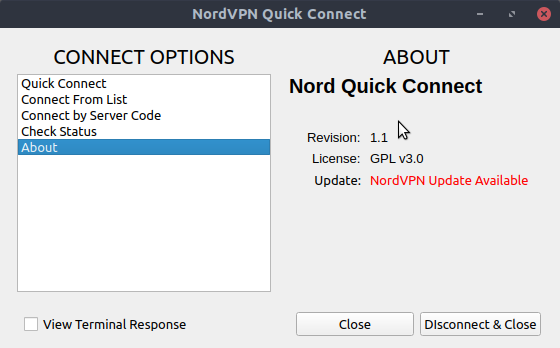
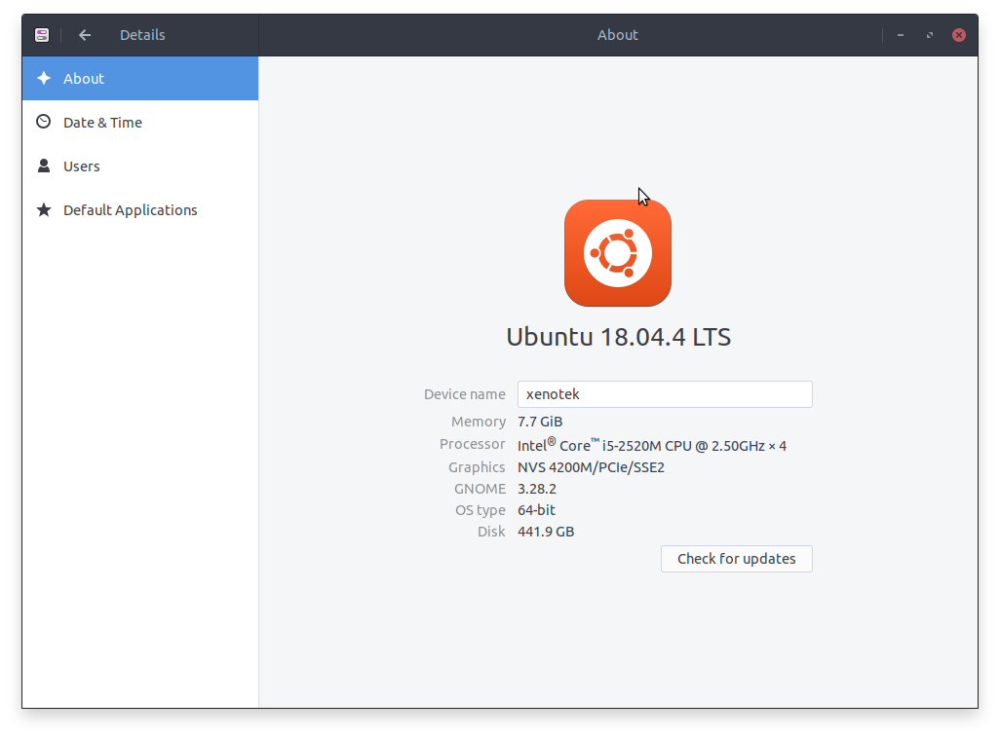
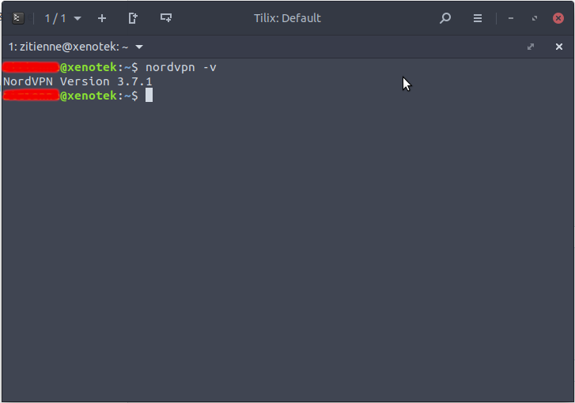

# [NordVPN](https://nordvpn.com)QuickConnect









## Introduction
[NordVPN](https://nordvpn.com) QuickConnect is a desktop utility that gives easy user interface to replace the CLI that comes with [NordVPN](https://nordvpn.com) on linux machines

The program was created using PyQT5 and python3. Requirements are listed below:
* colorlog==4.0.2
* pkg-resources==0.0.0
* PyQt5==5.14.2
* PyQt5-sip==12.7.2
* PyQt5-stubs==5.14.2.2
* simplelogging==0.10.0

To install requirements open a terminal in the folder and execute 
```bash
pip3 install requirements.txt
```

## Development/Testing environment
* The program was tested on a Dell Latitude 6420 laptop running [Ubuntu](https://ubuntubudgie.org/) 18.04
* [Budgie Desktop](https://ubuntubudgie.org/)
* [NordVPN](https://nordvpn.com) version is 3.7.1





## Disclaimer
This application has no official connection to [NordVPN](https://nordvpn.com). 

The developer has no connection to [NordVPN](https://nordvpn.com)
 
> **_!! NOTE:_**  USE OF THIS APPLICATION IS AT THE USERS OWN RISK

## Installation

This readme assumes that the [NordVPN](https://nordvpn.com) app has been installed as indicated on the [NordVPN](https://nordvpn.com/download/linux/) website

1. Download a copy from [Github](path to project)
2. Extract to personal folder
3. Open a terminal and type Inline `nordvpn login`
4. Enter registration details
5. Wait for login is successful message
6. Copy the `NordVPNQuickConnect.desktop` to your desktop
7. Open the `NordVPNQuickConnect.desktop` file in a text editor. Enter the complete path the `nqc_main.py` where indicated in the file
8. Right click on the file and select Properties. Under permissions, check the `Allow Executing File As Program` checkbox
9. Now when you click on the Desktop file it should open the program   
10. To log out of [NordVPN](https://nordvpn.com), open a Terminal and type `nordvpn logout`

## Contributing
Pull requests are welcome. For major changes, please open an issue first to discuss what you would like to change.

## License
[GPL-3.0](https://choosealicense.com/licenses/gpl-3.0/)

